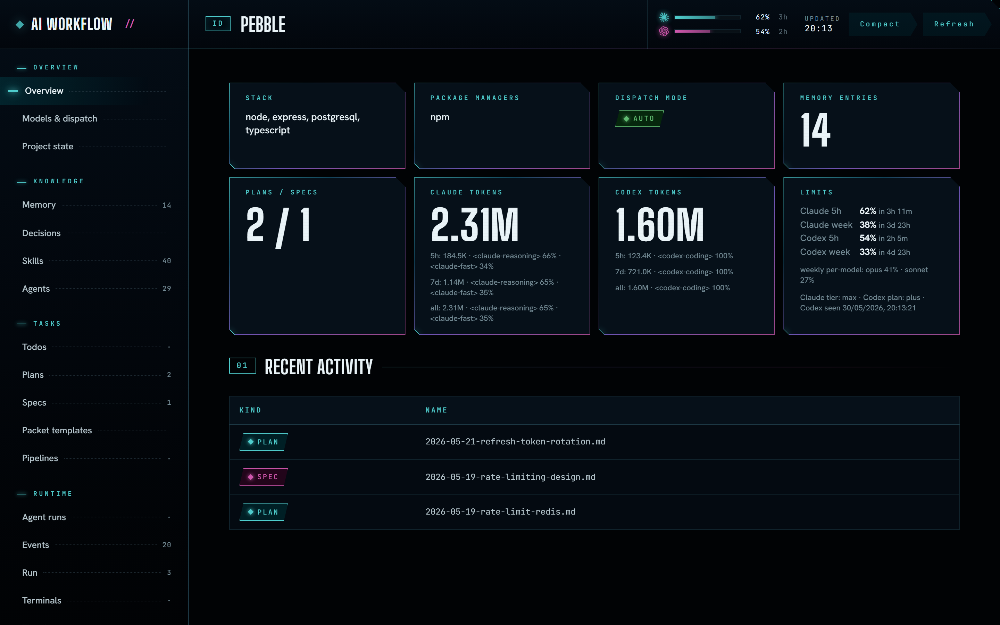
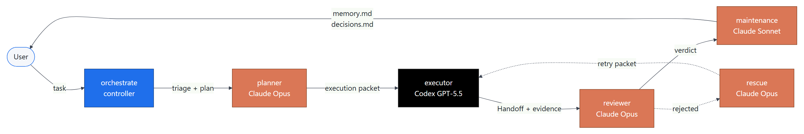
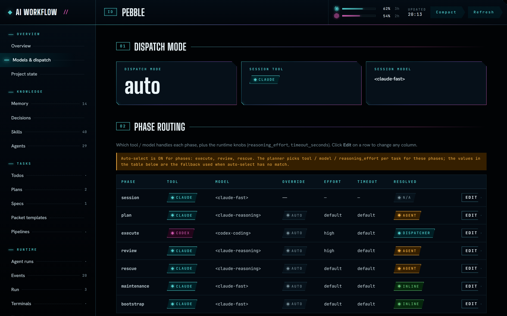
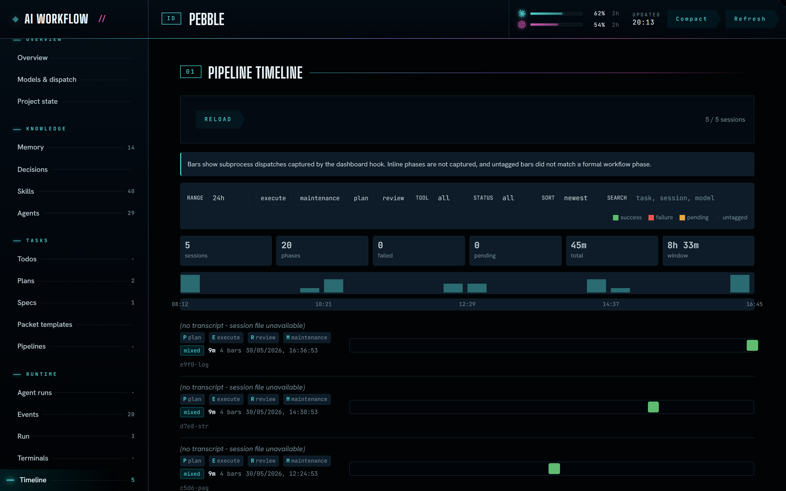
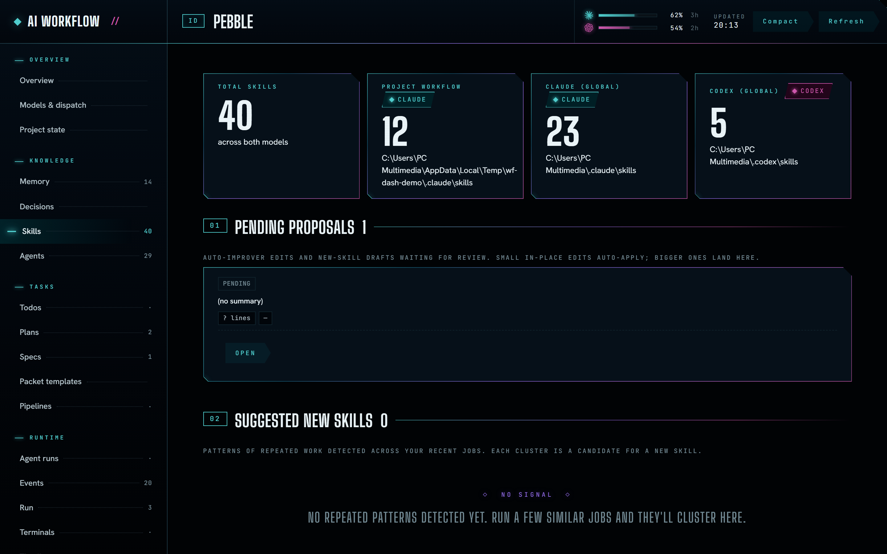
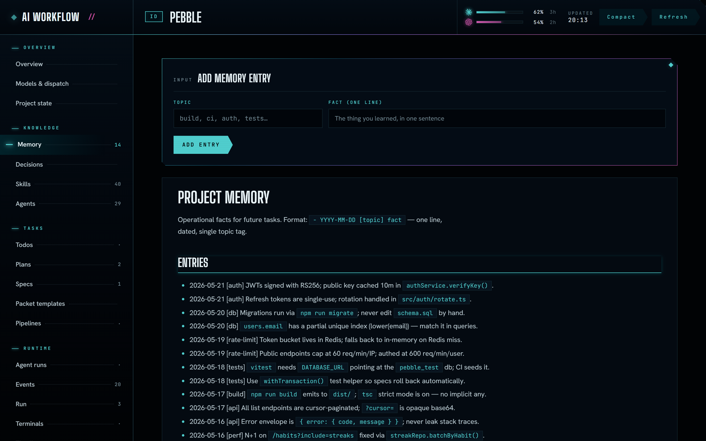
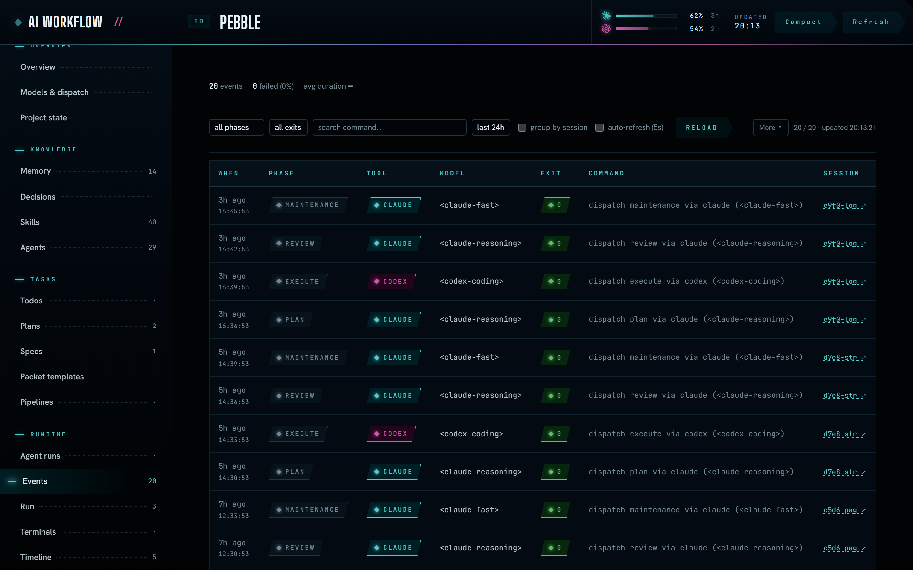

<div align="center">

# AI Dev Workflow Template

**A disciplined, self-improving multi-agent coding workflow that routes `plan → execute → review → rescue` across Claude and Codex — without losing context, scope, or evidence.**

<sub>Drop it into any repo. It plans, builds, reviews, and remembers — and it gets a little better every task it runs.</sub>

[](#how-it-works)
[](#gets-better-over-time)
[](https://claude.com/claude-code)
[](https://github.com/openai/codex)
[](#quick-start)

[Quick start](#quick-start) · [How it works](#how-it-works) · [Gets better over time](#gets-better-over-time) · [Configuration](#configuration) · [Running tasks](#running-tasks) · [Dashboard](#dashboard) · [Skills](#skills)

<br />



<sub><i>The bundled local dashboard. Screenshots use a sample project with placeholder data.</i></sub>

</div>

---

## What it helps with

Point it at a repo and hand it a task in plain English. It:

- **Breaks the work down** — triages size, writes a plan (and a spec for big changes), and keeps scope narrow.
- **Builds it** — executes against a tight packet, runs your validation commands, and proves the result with exit codes and output.
- **Reviews itself** — a separate model checks the work before it ships; a `rescue` pass recovers failed attempts.
- **Remembers** — operational facts land in `memory.md`, architectural calls in `decisions.md`, so the next task starts smarter than the last.
- **Picks the right model for the job** — each phase runs in the tool and model you assigned (Claude or Codex), never whatever happened to be loaded.

It's a template, not a framework: plain Markdown contracts and Bash installers, no runtime to adopt or lock-in to fight.

## Why this exists

Multi-agent coding setups tend to break in three ways:

1. **Model drift** — phases silently run in whatever model happens to be loaded.
2. **Scope creep** — agents "helpfully" refactor things you didn't ask about.
3. **Evidence gap** — "done" without proof, then surprises in review.

This template enforces a contract: **every phase runs in the model you configured**, against a **narrow packet**, and lands a **Handoff with validation evidence** — or it doesn't ship.

## Highlights

- **Phase-pinned dispatch.** `plan`, `execute`, `review`, `rescue`, `maintenance` each run in the tool and model assigned in `.ai/models.yaml`. The controller never substitutes its own model.
- **Size-gated pipeline.** Trivial tasks skip ceremony; medium and large tasks get full `plan → execute → review`.
- **Auto model selection.** Optional planner-driven `(size, risk, budget) → (tool, model, reasoning_effort)` lookup table.
- **Self-improving.** Every phase logs a metrics row; the model lookup table is tuned from measured outcomes, skills and agents get audited and rewritten via `proposals/`, and memory consolidates as it grows. The workflow you run next month isn't the one you installed.
- **Cache-stable prompt layout.** Sequential phases of one task share a byte-identical prefix to hit Anthropic's prompt cache (5-min TTL).
- **Structured escalation.** Dispatched subprocesses emit `## Escalation` blocks instead of hanging or crashing silently.
- **Handoff with evidence.** Executor must paste exit code + output tail for each validation command. No self-reported success.
- **Memory + decisions contract.** Operational discoveries land in `.ai/memory.md`; architectural choices in `.ai/decisions.md`. Phases read these on demand.
- **Local web dashboard.** Tail events, browse plans/specs, spawn orchestrate jobs, flip dispatch mode live.
- **Mirrored skills.** `.claude/skills/` is canonical; `.agents/skills/` (in-repo) and `~/.agents/skills/` (global) mirror so Codex discovers the same set.
- **Bash-only install.** No package manager, no Docker. `install.sh` copies files; `update-workflow.sh` propagates changes.

## How it works

<p align="center">
  <a href=".github/assets/diagrams/pipeline.png">
    
  </a>
</p>

Each arrow is a dispatched call — a fresh subprocess (or in-process subagent) with the configured model, the relevant skill body, the packet schema, and the task context piped in via stdin. The controller blocks on each one, captures exit status, then routes the next phase.

The full routing contract — `auto` vs `manual` dispatch, `inline | agent | dispatcher` modes, the resume rule, the dispatch error table — lives in [`.ai/workflow/dispatch.md`](.ai/workflow/dispatch.md).

## Gets better over time

The workflow isn't static. It watches itself run and feeds what it learns back into the next task — four loops, each writing to a different layer of state.

| Loop | What it observes | What it regenerates |
| ---- | ---------------- | ------------------- |
| **Adaptive model selection** | Every dispatched phase appends a row to `.ai/ledgers/metrics.jsonl` (tool, model, effort, outcome, duration). | The `(size, risk, budget) → model` lookup table in [`auto-models.md`](.ai/workflow/auto-models.md) — tuned from measured outcomes, not guesses. |
| **Skill & agent auto-improver** | Skill and agent quality scores (`skill_metrics.jsonl`, `improvements.jsonl`). | Rewritten skills and agents, staged as reviewable old/new diffs under [`.ai/dashboard/proposals/`](.ai/dashboard/proposals/) before anything is applied. |
| **Accumulating memory** | Operational facts and architectural decisions surfaced while working. | `memory.md` and `decisions.md` grow per task; `maintenance` consolidates them once they cross the `memory_tuning` thresholds in [`project.yaml`](.ai/project.yaml). |
| **Regenerating mirror** | Canonical skills in `.claude/skills/`. | `.agents/skills/` is re-synced so Codex always sees the same contract Claude does — no manual copy-paste, no drift. |

Nothing rewrites itself silently: improvements land as **proposals you review**, metrics inform but don't override your `models.yaml`, and the immutable workflow core stays read-only. The system gets sharper while you stay in control.

## Quick start

### 1. Install the scaffold

From the target repo root:

```bash
bash /path/to/ai-dev-workflow-template/install.sh .
```

This:

- Creates `.ai/`, `.claude/skills/`, and `.agents/skills/` trees.
- Writes managed blocks into [`AGENTS.md`](AGENTS.md) (Codex) and [`CLAUDE.md`](CLAUDE.md) (Claude) without clobbering existing instructions.
- Drops in default `.ai/models.yaml`, packet schemas, and the dashboard files.

### 2. Bootstrap your repo

Launch through the tool/model assigned to `bootstrap` in `.ai/models.yaml`, then ask the agent:

```text
Use the bootstrap skill. Adapt this repository to the workflow scaffold.
```

Bootstrap detects the stack, fills [`.ai/project.yaml`](.ai/project.yaml), and may add per-directory `AGENTS.md` files for repos with clear domain separation.

### 3. Run a task

```text
Use the orchestrate skill.

Task: Add rate limiting to the public API endpoints.
```

The starter session becomes a controller. It triages the size, plans, executes via Codex, reviews via Claude, and runs maintenance if memory needs updating. Each phase reports which tool/model ran it.

## Configuration

**You decide which tool and which model runs each task.** Every phase's assignment lives in [`.ai/models.yaml`](.ai/models.yaml) — each phase declares a `tool` (`claude` or `codex`) and a `model`, plus optional `mode`, `timeout_seconds`, and `reasoning_effort`.

```yaml
dispatch_mode: auto    # auto | manual

session:
  tool: claude
  model: <your-claude-model>     # the starter session / controller

plan:
  tool: claude
  model: <your-claude-model>     # use your strongest reasoning model here

execute:
  tool: codex
  model: <your-codex-model>      # or claude — your call

review:
  tool: claude
  model: <your-claude-model>
```

Each phase below can run on whatever tool/model you point it at — swap any line and that phase obeys it. Pick the exact model names from whatever Claude / Codex versions you currently have access to; the workflow never hard-codes them.

| Phase         | Default tool | Typical use                              |
| ------------- | ------------ | ---------------------------------------- |
| `session`     | claude       | Starter session (the controller)         |
| `plan`        | claude       | Triage, scope, packet authoring          |
| `execute`     | codex        | Code edits, command runs, validation     |
| `review`      | claude       | Reads the Handoff, files findings        |
| `rescue`      | claude       | Recovery after a failed execute          |
| `maintenance` | claude       | Updates `memory.md` and `decisions.md`   |
| `bootstrap`   | claude       | One-time repo adaptation                 |

Edit any field to swap. `install.sh` treats `models.yaml` as `copy_if_missing`, so your customisations survive re-runs.

### Auto model selection

Set `auto_select.enabled: true` and the planner picks per-phase `(tool, model, reasoning_effort)` from a lookup table — see [`.ai/workflow/auto-models.md`](.ai/workflow/auto-models.md). Misses fall back to `models.yaml`. Only `execute`, `review`, and `rescue` are auto-selectable; `plan`, `maintenance`, and `bootstrap` are always served from config.

## Running tasks

### Full pipeline (recommended)

```text
Use the orchestrate skill.

Task: <one-paragraph description>
```

The orchestrator will:

1. Triage size (`trivial` / `small` / `medium` / `large`).
2. Dispatch planning to the configured `plan` tool/model.
3. Send the execution packet to the configured `execute` tool/model.
4. Run review when **Risk level is `elevated`** OR **Size is `medium` / `large`**.
5. Confirm with you before sending review findings back for a rework pass.
6. Run maintenance if memory or decisions need updating.
7. Report the outcome, including which tool/model ran each phase.

### Size gate

| Size      | Scope                              | Pipeline                                  |
| --------- | ---------------------------------- | ----------------------------------------- |
| `trivial` | single file, < 10 lines            | one-line instruction, no packets          |
| `small`   | 1–3 files, clear scope             | minimal execute packet, review if risky   |
| `medium`  | 4–10 files or cross-subsystem      | full plan + execute + review              |
| `large`   | > 10 files or unclear architecture | full plan + execute + review (often spec) |

### Running a single phase manually

Launch in the tool/model assigned to that phase. Bare invocations:

```text
Use the planner skill.
Task: <description>
```

```text
Use the reviewer skill.
<paste Handoff section here>
```

```text
Use the rescue skill.
Task: <original task>
What was attempted: <summary>
What failed: <evidence>
```

Manual runs **don't** emit a `.ai/ledgers/metrics.jsonl` row, so the adaptive selector can't score them. The orchestrator surfaces them as `source=manual` when replayed through the pipeline.

## Agent pipelines

The `plan → execute → review` pipeline is built for **code changes**. For everything else — research, writing, multi-step analysis, anything you'd hand to a specialist — there's a second track that orchestrates **your own agent catalog** (project, user, and installed plugin agents) instead of fixed phases.

Two skills drive it:

- **`orchestrate-agents`** — describe a task and it drafts a pipeline: it scans every agent you have, picks the ones whose specialties fit each subtask, wires them into a dependency graph, and offers **Save & run**, **Save only**, or **Discard**. Drafts are saved as plain YAML in `.ai/pipelines/<name>.yaml`.
- **`run-pipeline`** — executes a saved pipeline. It resolves each node against the live catalog, runs independent agents in parallel and dependent ones in order, and combines the results one of three ways:

  | Output mode    | Result                                                              |
  | -------------- | ------------------------------------------------------------------- |
  | `passthrough`  | Returns the output of a single chosen node.                         |
  | `synthesize`   | A configured model fuses every node's output into one answer.       |
  | `per-agent`    | Returns each agent's result separately, keyed by node.              |

If one agent fails, only the nodes that depend on it are skipped — independent branches keep going. Every run is persisted to `.ai/agent-runs/<date>-<slug>.md` and logs metrics rows to the same ledger as the code pipeline, so agent runs feed the **gets-better-over-time** loops too.

```text
Use the orchestrate-agents skill. Task: <what you want done>
```

## Dashboard

A local web dashboard ships under [`.ai/dashboard/`](.ai/dashboard/).

```bash
python .ai/dashboard/serve.py
```

Then open <http://localhost:8765/.ai/dashboard/>.

It serves the repo as read-only static files plus a small JSON / SSE / WebSocket API for:

- Browsing `.ai/plans/` and `.ai/specs/`
- Appending entries to `memory.md` and `decisions.md` from the UI
- Tailing `.ai/ledgers/events.jsonl` in real time, clearing it on demand
- Flipping `dispatch_mode` between `auto` and `manual`
- Spawning `orchestrate` and `planner` subprocesses, streaming their logs, and writing to their stdin

Events and per-job logs (`.ai/ledgers/events.jsonl`, `.ai/dashboard/jobs/`) are gitignored.

<table>
  <tr>
    <td width="50%"><br /><sub><b>Models &amp; dispatch</b> — pin a tool and model to every phase.</sub></td>
    <td width="50%"><br /><sub><b>Timeline</b> — every dispatched phase, grouped by run.</sub></td>
  </tr>
  <tr>
    <td width="50%"><br /><sub><b>Skills</b> — with pending auto-improver proposals to review.</sub></td>
    <td width="50%"><br /><sub><b>Memory</b> — the operational facts that accrue per task.</sub></td>
  </tr>
  <tr>
    <td colspan="2"><br /><sub><b>Events</b> — a live feed of dispatches with tool, model, and exit code.</sub></td>
  </tr>
</table>

<sub><i>All screenshots are from a throwaway sample project ("Pebble") populated with placeholder data — not real project state.</i></sub>

## Skills

Skills are the unit of executable contract. Each one lives in `.claude/skills/<name>/SKILL.md` (canonical) and is mirrored to `.agents/skills/<name>/SKILL.md` for Codex.

| Skill            | Role                                                              |
| ---------------- | ----------------------------------------------------------------- |
| `bootstrap`      | One-time repo adaptation; fills `.ai/project.yaml`                |
| `planner`        | Triage → spec (if needed) → execution packet                      |
| `orchestrate`    | Controller; dispatches every phase per `models.yaml`              |
| `reviewer`       | Checks Handoff against packet, files verdict                      |
| `rescue`         | Recovery packet after a failed `execute`                          |
| `maintenance`    | Updates `memory.md`, `decisions.md`, `project.yaml`               |
| `codex`          | Claude-side: how to call Codex from within a Claude session       |
| `claude`         | Codex-side: how to call Claude from within a Codex session        |
| `agent-creator`  | Scaffolds new `.claude/agents/<name>.md` files                    |
| `agent-improver` | Audits + improves existing agent files against a quality rubric   |
| `orchestrate-agents` | Drafts an agent pipeline from your catalog; Save & run / Save only / Discard |
| `run-pipeline`   | Executes a saved `.ai/pipelines/<name>.yaml` agent pipeline        |
| `synthesizer`    | Fuses multi-agent pipeline outputs into one answer (`synthesize` mode) |

Edit upstream in `.claude/skills/`, then run `update-workflow.sh` to re-mirror.

## Layer model

| Layer              | Files                                                                                                              | Mutability                                              |
| ------------------ | ------------------------------------------------------------------------------------------------------------------ | ------------------------------------------------------- |
| **Workflow core**  | `.ai/workflow/*.md`, `.claude/skills/*/SKILL.md`, `install.sh`, `update-workflow.sh`                               | Read-only; changes only when evolving the workflow.     |
| **Packet schemas** | `.ai/packets/*.md`                                                                                                 | Read-only templates. Phases **read** and **emit** filled copies — never edit. |
| **Project state**  | `.ai/project.yaml`, `.ai/memory.md`, `.ai/decisions.md`, `.ai/memory-archive.md`                                   | Mutable per task by `maintenance` + human edits.        |
| **Task instances** | `.ai/plans/<date>-<slug>.md`, `.ai/specs/<date>-<slug>.md`                                                         | New files only — never overwrite dated files.           |

Filled packets flow via stdin / temp files. Editing `.ai/packets/*.md` during a task is a workflow violation.

## Folder layout

<details>
<summary>Click to expand</summary>

```text
.
├── AGENTS.md                       # Codex-facing instructions (managed block)
├── CLAUDE.md                       # Claude import (managed block)
├── install.sh                      # One-shot scaffold installer
├── update-workflow.sh              # Propagates workflow updates to existing projects
├── .ai/
│   ├── project.yaml                # Project metadata (filled by bootstrap)
│   ├── models.yaml                 # Tool/model assignment + dispatch_mode per phase
│   ├── memory.md                   # Operational facts
│   ├── decisions.md                # Stable architecture decisions
│   ├── memory-archive.md           # Append-only by consolidation; never read by phases
│   ├── ledgers/                    # Append-only JSONL streams (events, metrics, jobs, todos) — gitignored
│   ├── plans/                      # Persistent filled plans for medium/large tasks
│   ├── specs/                      # Persistent spec documents
│   ├── pipelines/                  # Saved agent-pipeline YAML drafts
│   ├── agent-runs/                 # Persisted agent-pipeline run records
│   ├── packets/
│   │   ├── plan.md                 # Planning packet schema
│   │   ├── execute.md              # Execution packet (Steps + Handoff)
│   │   ├── review.md               # Review packet (checklist)
│   │   └── rescue.md               # Rescue packet
│   ├── workflow/
│   │   ├── workflow.md             # Pipeline contract + shared rules
│   │   ├── dispatch.md             # Routing modes, prompts, resume rule, errors
│   │   ├── auto-models.md          # Auto-selection decision table
│   │   └── agents-block.md         # Injected into AGENTS.md
│   └── dashboard/
│       ├── index.html              # Local web UI
│       ├── styles.css
│       ├── serve.py                # Static + JSON/SSE/WS server
│       ├── app/                    # Split frontend modules (core/skills/jobs/terminals)
│       ├── scripts/                # Sibling helpers (log_event, pty_session, todos_parser, demo)
│       ├── proposals/              # Auto-improver artifacts (agents/, skills/, backups)
│       └── jobs/                   # Per-job log dirs (gitignored)
├── .claude/
│   ├── skills/                     # Canonical source for shared skills
│   │   ├── orchestrate/SKILL.md
│   │   ├── planner/SKILL.md
│   │   ├── reviewer/SKILL.md
│   │   ├── maintenance/SKILL.md
│   │   ├── rescue/SKILL.md
│   │   ├── bootstrap/SKILL.md
│   │   ├── codex/SKILL.md          # Claude-side: how to call Codex
│   │   ├── agent-creator/SKILL.md
│   │   └── agent-improver/SKILL.md
│   ├── agents/                     # Project-scoped Claude agents
│   └── settings.json
└── .agents/
    └── skills/                     # Codex-visible mirror (synced from .claude/skills/)
        ├── claude/SKILL.md         # Codex-only: how to call Claude (no Claude counterpart)
        └── <shared skills>         # Mirrored copies — edit upstream
```

</details>

## Updating an existing project

If you change a shared workflow skill and want to propagate it to a project that already uses this scaffold:

```bash
bash /path/to/ai-dev-workflow-template/update-workflow.sh /path/to/target-project
```

**Refreshed by default:**

- `.claude/skills/*` (canonical)
- `.agents/skills/{orchestrate,planner,reviewer,maintenance,rescue,bootstrap,codex,claude}/SKILL.md` (in-repo + global Codex mirrors)
- `.ai/workflow/*` (`workflow.md`, `dispatch.md`, `agents-block.md`, `auto-models.md`)
- Managed blocks in `AGENTS.md` and `CLAUDE.md`

**Preserved by default:**

- `.ai/packets/*`
- `.ai/models.yaml`
- `.ai/project.yaml`
- `.ai/memory.md`
- `.ai/decisions.md`

Add `--include-packets` to refresh packet templates as well.

## Operating principles

- Keep packets narrow.
- Stop on blockers instead of guessing — emit an `## Escalation` block.
- List assumptions explicitly.
- Do not silently broaden scope.
- Fill the Handoff section, with validation evidence, before declaring done.
- Update `memory.md` after tasks that reveal operational facts; `decisions.md` only for stable architectural calls.

## Compatibility

| Component      | Required                                                                |
| -------------- | ----------------------------------------------------------------------- |
| Shell          | `bash` (POSIX). Works under Git Bash / WSL on Windows.                  |
| Claude         | [Claude Code](https://claude.com/claude-code) CLI on `PATH`             |
| Codex          | [`codex`](https://github.com/openai/codex) CLI on `PATH`                |
| Dashboard      | Python 3.10+ (stdlib only)                                              |

The orchestrator stops with a clear error if any configured tool isn't on `PATH` — it never silently falls back.

## Contributing

This is an opinionated scaffold; the contract surface is small on purpose. PRs are welcome for:

- Bug fixes in `install.sh`, `update-workflow.sh`, or the dashboard server.
- Dispatch-error edge cases (timeouts, escalation parsing, exit-code routing).
- New entries in the auto-model lookup table backed by measured outcomes.

Please avoid:

- New skills layered on top of existing ones — propose them in an issue first.
- Changes that broaden a packet schema without a corresponding contract update in `dispatch.md` / `workflow.md`.
