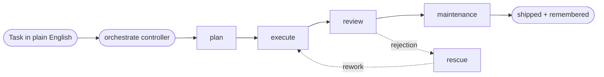

<div align="center">

# AI Dev Workflow Template

**A disciplined, self-improving multi-agent coding workflow that pins `plan → execute → review → rescue` to the Claude or Codex model _you_ choose — no model drift, no scope creep, no "done" without proof.**

<sub>Drop it into any repo. Plain Markdown contracts + Bash installers — a template, not a framework. It plans, builds, reviews, remembers, and gets a little sharper every task it runs.</sub>

[](#how-it-works)
[](#gets-better-over-time)
[](https://claude.com/claude-code)
[](https://github.com/openai/codex)


<sub><i>The bundled local dashboard. Screenshots use a sample project with placeholder data.</i></sub>

</div>

---

## What it does

Hand it a task in plain English. It triages the size, writes a narrow plan (a spec for big changes), executes against a tight packet, proves the result with exit codes + output, and has a **separate** model review before anything ships. Discoveries land in memory, so the next task starts smarter than the last.

It exists to fix the three ways multi-agent setups rot — each one closed by a contract, not a convention:

| Failure mode | The contract that prevents it |
| --- | --- |
| **Model drift** — phases silently run in whatever model is loaded | Every phase runs in the tool + model pinned in `models.yaml`; the controller never substitutes its own. |
| **Scope creep** — agents "helpfully" refactor what you didn't ask about | Narrow packets, smallest correct change, no silent broadening. |
| **Evidence gap** — "done" with no proof, then surprises in review | Handoff requires an exit code + output tail per validation command, or it doesn't ship. |

## Highlights

- **Phase-pinned dispatch** — `plan` · `execute` · `review` · `rescue` · `maintenance`, each in its assigned tool/model. Claude plans, Codex builds, Claude reviews — or whatever split you configure.
- **Size-gated pipeline** — trivial tasks get a one-line instruction; medium/large earn full `plan → execute → review` (+ spec). No ceremony you didn't need.
- **Evidence-gated handoff** — the executor pastes exit codes + output for every validation command. Self-reported success is rejected.
- **Self-improving** — four feedback loops tune the model table, rewrite skills/agents as reviewable proposals, consolidate memory, and re-sync the Codex mirror. The workflow you run next month isn't the one you installed.
- **Auto model selection** — optional planner-driven `(size, risk, budget) → (tool, model, reasoning_effort)` lookup, with `models.yaml` as fallback.
- **Structured escalation** — a stuck subprocess emits an `## Escalation` block instead of hanging or failing silently.
- **Cache-stable prompts** — sequential phases of one task share a byte-identical prefix to hit Anthropic's prompt cache (5-min TTL).
- **Agent pipelines** — a second track orchestrates _your own_ agent catalog for research, writing, and analysis — anything that isn't a code change.
- **Local dashboard** — tail events, browse plans/specs, edit memory, flip dispatch mode, spawn jobs.
- **Bash-only, no lock-in** — `install.sh` copies files, `update-workflow.sh` propagates them. No package manager, no Docker, no runtime to adopt.

## How it works



Each arrow is a dispatched call in that phase's **configured tool + model** — set in [`models.yaml`](.ai/models.yaml), never assumed. Each is a fresh subprocess (or in-process subagent) carrying that model, the phase's skill body, the packet schema, and task context piped in via stdin. The controller blocks on each one, captures its exit status, then routes the next phase. The full routing contract (`auto`/`manual`, `inline | agent | dispatcher`, the resume rule, the error table) lives in [`dispatch.md`](.ai/workflow/dispatch.md).

| Size | Scope | Pipeline |
| --- | --- | --- |
| `trivial` | 1 file, < 10 lines | one-line instruction, no packets |
| `small` | 1–3 files, clear scope | minimal execute packet, review if risky |
| `medium` | 4–10 files / cross-subsystem | full `plan → execute → review` |
| `large` | > 10 files / unclear architecture | full pipeline, often + spec |

## Gets better over time

Four loops, each writing to a different layer of state. Nothing rewrites itself silently — improvements land as proposals you review, metrics inform but never override your `models.yaml`, and the workflow core stays read-only.

| Loop | Observes | Regenerates |
| --- | --- | --- |
| **Adaptive model selection** | every dispatched phase → `metrics.jsonl` (tool, model, effort, outcome, duration) | the `(size, risk, budget) → model` table in [`auto-models.md`](.ai/workflow/auto-models.md) — tuned from measured outcomes |
| **Skill & agent auto-improver** | skill/agent quality scores | rewritten skills and agents, staged as old/new diffs under [`proposals/`](.ai/local/proposals/) |
| **Accumulating memory** | facts + decisions surfaced while working | `memory.md` / `decisions.md`; `maintenance` consolidates them past the `project.yaml` thresholds |
| **Regenerating mirror** | canonical `.claude/skills/` | re-synced `.agents/skills/` so Codex always sees the same contract Claude does |

## Quick start

```bash
# 1. Install the scaffold from the target repo root
bash /path/to/ai-dev-workflow-template/install.sh .
```

Creates the `.ai/`, `.claude/skills/`, and `.agents/skills/` trees; writes managed blocks into `AGENTS.md` (Codex) and `CLAUDE.md` (Claude) without clobbering existing instructions; drops in default `models.yaml`, packet schemas, and the dashboard.

```text
# 2. Bootstrap — detects the stack, fills .ai/project.yaml
Use the bootstrap skill. Adapt this repository to the workflow scaffold.

# 3. Run a task
Use the orchestrate skill.
Task: Add rate limiting to the public API endpoints.
```

The session becomes a controller: it triages, plans (Claude), executes (Codex), reviews (Claude), and runs maintenance if memory changed — each phase reporting which tool/model ran it. For test-first work, swap in `orchestrate-tdd` (RED → GREEN → REFACTOR, with the gate command run by the controller itself).

## Configure

You pin every phase in [`.ai/models.yaml`](.ai/models.yaml). Each declares a `tool` (`claude` or `codex`) and a `model`, plus optional `mode`, `timeout_seconds`, and `reasoning_effort`:

```yaml
dispatch_mode: auto          # auto | manual
session:  { tool: claude, model: <your-claude-model> }   # the controller
plan:     { tool: claude, model: <your-claude-model> }   # strongest reasoning here
execute:  { tool: codex,  model: <your-codex-model>  }   # or claude — your call
review:   { tool: claude, model: <your-claude-model> }
```

| Phase | Default | Role |
| --- | --- | --- |
| `session` | claude | the controller |
| `plan` | claude | triage, scope, packet authoring |
| `execute` | codex | edits, command runs, validation |
| `review` | claude | reads the Handoff, files findings |
| `rescue` | claude | recovery after a failed execute |
| `maintenance` | claude | updates `memory.md` / `decisions.md` |
| `bootstrap` | claude | one-time repo adaptation |

The model names stay yours — the workflow never hard-codes them, and `install.sh` preserves your `models.yaml` on re-run. Set `auto_select.enabled: true` to let the planner pick `execute`/`review`/`rescue` from the lookup table, falling back to config on a miss. The controller stops with a clear error if a configured tool isn't on `PATH` — it never silently falls back.

## Beyond code: agent pipelines

The phase pipeline is built for code changes. For research, writing, or multi-step analysis, a second track orchestrates **your own** agent catalog (project, user, and installed plugin agents):

- **`orchestrate-agents`** drafts a pipeline — scans every agent you have, wires the fits into a dependency graph, and offers **Save & run** / **Save only** / **Discard** (saved as `.ai/local/pipelines/<name>.yaml`).
- **`run-pipeline`** executes one — independent nodes in parallel, dependent ones in order, combined via `passthrough`, `synthesize`, or `per-agent`. A failed node only skips its dependents. Runs persist to `.ai/local/agent-runs/` and feed the same improvement loops.

```text
Use the orchestrate-agents skill. Task: <what you want done>
```

## Dashboard

```bash
python .ai/dashboard/serve.py     # → http://localhost:8765/.ai/dashboard/
```

A read-only static file server plus a small JSON / SSE / WebSocket API: browse `plans/` and `specs/`, append to `memory.md` / `decisions.md`, tail `events.jsonl` live, flip `dispatch_mode`, and spawn/stream `orchestrate` + `planner` jobs. Python 3.10+, stdlib only.

<details>
<summary>Screenshots</summary>

<table>
  <tr>
    <td width="50%"><br /><sub><b>Models &amp; dispatch</b> — pin a tool and model to every phase.</sub></td>
    <td width="50%"><br /><sub><b>Timeline</b> — every dispatched phase, grouped by run.</sub></td>
  </tr>
  <tr>
    <td width="50%"><br /><sub><b>Skills</b> — with pending auto-improver proposals to review.</sub></td>
    <td width="50%"><br /><sub><b>Memory</b> — the operational facts that accrue per task.</sub></td>
  </tr>
  <tr>
    <td colspan="2"><br /><sub><b>Events</b> — a live feed of dispatches with tool, model, and exit code.</sub></td>
  </tr>
</table>

<sub><i>All screenshots are from a throwaway sample project populated with placeholder data — not real project state.</i></sub>

</details>

## Skills

Skills are the unit of executable contract. Each lives in `.claude/skills/<name>/SKILL.md` (canonical) and is mirrored to `.agents/skills/` for Codex — edit upstream, then run `update-workflow.sh` to re-mirror.

| Skill | Role |
| --- | --- |
| `bootstrap` | one-time repo adaptation; fills `project.yaml` |
| `planner` | triage → spec (if needed) → execution packet |
| `orchestrate` | controller; dispatches every phase per `models.yaml` |
| `orchestrate-tdd` | controller variant; enforces RED → GREEN → REFACTOR |
| `reviewer` | checks Handoff against packet, files a verdict |
| `rescue` | recovery packet after a failed `execute` |
| `maintenance` | updates `memory.md`, `decisions.md`, `project.yaml` |
| `codex` / `claude` | cross-calling: invoke one tool from inside the other |
| `agent-creator` / `agent-improver` | scaffold and audit `.claude/agents/*.md` files |
| `orchestrate-agents` / `run-pipeline` | draft and execute agent pipelines from your catalog |
| `synthesizer` | fuses multi-agent pipeline outputs into one answer |

## Reference

Four layers, with strict mutability rules — filled packets flow via stdin/temp files; editing a packet schema during a task is a workflow violation.

| Layer | Files | Mutability |
| --- | --- | --- |
| **Workflow core** | `.ai/workflow/*.md`, `.claude/skills/*/SKILL.md`, install scripts | read-only; changes only when evolving the workflow |
| **Packet schemas** | `.ai/packets/*.md` | read-only templates; phases **read** + **emit** filled copies |
| **Project state** | `project.yaml`, `memory.md`, `decisions.md` | mutable per task by `maintenance` + human edits |
| **Task instances** | `.ai/plans/<date>-<slug>.md`, `.ai/specs/…` | new files only — never overwrite dated files |

Propagate a changed workflow skill to an existing project with `bash /path/to/template/update-workflow.sh /path/to/target` — it refreshes `.claude/skills/*`, the Codex mirror, `.ai/workflow/*`, and the managed `AGENTS.md` / `CLAUDE.md` blocks, while preserving your `models.yaml`, `project.yaml`, `memory.md`, `decisions.md`, and packets (add `--include-packets` to refresh those too).

**Requires:** `bash` (POSIX; Git Bash / WSL on Windows), the [Claude Code](https://claude.com/claude-code) CLI on `PATH`, and Python 3.10+ for the dashboard. [`codex`](https://github.com/openai/codex) is **optional** — you only need it to dispatch a phase (by default `execute`) to Codex. Without it, point every phase at `claude` in `models.yaml` and the whole pipeline runs on Claude.

<details>
<summary>Folder layout</summary>

```text
.
├── install.sh / update-workflow.sh   # scaffold installer + propagator
├── AGENTS.md / CLAUDE.md             # managed instruction blocks (Codex / Claude)
├── .ai/
│   ├── project.yaml                  # project metadata (filled by bootstrap)
│   ├── models.yaml                   # tool/model per phase + dispatch_mode
│   ├── memory.md / decisions.md      # operational facts / architecture decisions
│   ├── ledgers/                      # append-only JSONL (events, metrics, jobs) — gitignored
│   ├── plans/ · specs/               # persistent plans + specs for medium/large tasks
│   ├── pipelines/ · agent-runs/      # agent-pipeline drafts + run records
│   ├── packets/                      # plan / execute / review / rescue schemas
│   ├── workflow/                     # workflow.md, dispatch.md, auto-models.md, agents-block.md
│   └── dashboard/                    # local web UI (serve.py, app/, scripts/, proposals/)
├── .claude/skills/                   # canonical skill sources (+ agents/, settings.json)
└── .agents/skills/                   # Codex-visible mirror (generated, not versioned; only the claude/ bridge is tracked)
```

</details>
